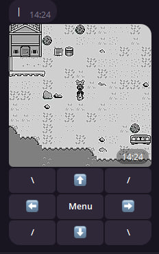

### Probably not so really important note

Tiled was used for maps

Can be heavy on ram

Might not be compatible with some hardware

Some of the code is outdated, awful, unoptimized, unfinished, or overthought

The idea is quite stupid in itself, so it doesn't really have any purpose

## Setup

-- Install Python [requirements.txt](requirements.txt)

-- Set the token of the bot in [config.py](forgotten-dream%2Fconfig.py)

-- Start the bot using a batch/shell script

## Credits

### Assets:

-- https://sondanielson.itch.io/gameboy-simple-rpg-tileset ; https://sondanielson.itch.io/

-- https://gumpyfunction.itch.io/game-boy-rpg-fantasy-tileset-free ; https://gumpyfunction.itch.io/

-- https://materialfuture.itch.io/gameboy-assets ; https://materialfuture.itch.io/

---

Original description starting here

# Forgotten-dream

This is the official repo for the ForgottenDream or some unknown RPG telegram bot
